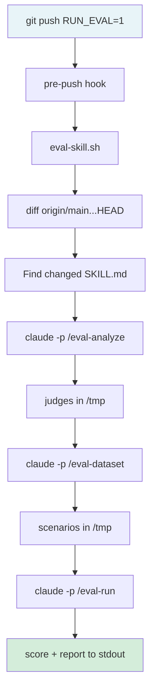
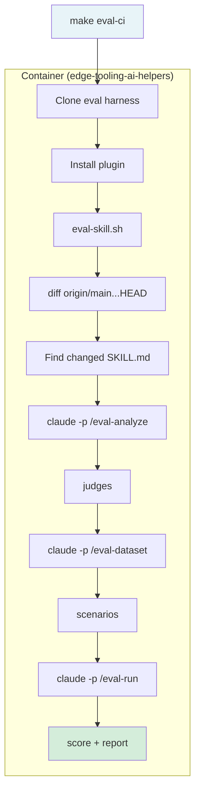
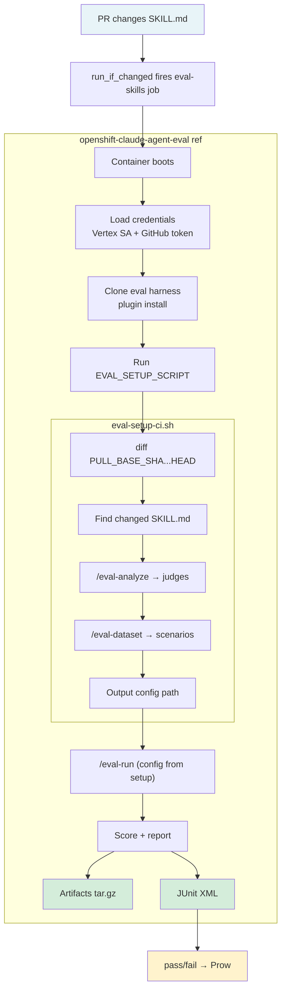

# Skill Eval CI Strategy

## Overview

This document describes how to integrate the
[agent-eval-harness](https://github.com/opendatahub-io/agent-eval-harness)
into CI for evaluating Claude Code skills. The eval harness provides
skills (`/eval-analyze`, `/eval-dataset`, `/eval-run`) that generate
scoring judges from a SKILL.md, create scenarios, and score a
skill's responses. The question is how best to wire that into CI so
skills are automatically evaluated when added or modified in a PR.

This document covers the three approaches to running evals, dynamic
skill discovery, and two maturity levels for scoring.

## Three Approaches to Running Evals

### 1. Local (`scripts/eval-skill.sh`)

Run evals directly on your local machine using your local Claude CLI
installation and credentials. No container involved — Claude runs as
a native process against your working tree. Triggered via a pre-push
git hook (`RUN_EVAL=1 git push`) or run directly. The script detects
which skill changed by diffing against the base branch, then runs the
full pipeline: analyze (generate judges), dataset (generate cases),
and run (score).

- **When to use**: Quick feedback during skill development.
- **Pros**: Fast iteration, no CI overhead, no image build. Runs
  against your local changes before they hit a PR.
- **Cons**: Requires Claude CLI and credentials on the developer's
  machine. Results aren't shared or archived. Environment may differ
  from CI.

### 2. Container (`make eval-ci`)

Build a container image (`edge-tooling-ai-helpers`) that includes the
repo and Claude CLI, then run the eval inside that container. The
Makefile target clones the eval harness, installs the plugin, and
calls `eval-skill.sh`.

- **When to use**: Reproducible local runs when you want the same
  environment CI uses.
- **Pros**: Reproducible environment, isolated from local machine
  differences.
- **Cons**: Slower than local (image build overhead). Still requires
  credentials to be injected. Not suitable as a CI approach on its
  own — produces no JUnit XML, no archived artifacts, and no
  structured reporting. Prow would only see a pass/fail exit code
  with no detail on what was evaluated or why it failed.

### 3. Step Registry (`openshift-claude-agent-eval` ref)

Use the shared step registry ref in `openshift/release`. The ref
provides plugin installation, `/eval-run` execution, artifact
collection, and JUnit XML generation. A repo-specific setup script
(`EVAL_SETUP_SCRIPT`) handles discovery and judge/case generation
before the ref runs the eval.

- **When to use**: CI presubmit jobs. This is the production path.
- **Pros**: Shared infrastructure across repos (edge-tooling,
  ai-helpers, and any future adopter). Credentials, artifact
  handling, and JUnit are built into the ref. One CI entry scales
  to any number of skills via dynamic discovery.
- **Cons**: Requires changes in two repos (the consuming repo and
  `openshift/release`). Debugging is harder than local runs.

**Decision**: We use the step registry approach (option 3) for CI,
with local runs (option 1) for developer feedback.

## Dynamic Skill Discovery

A single CI job handles skill evaluation. No per-skill CI entries are
needed — but the current implementation evaluates **one skill per run**.

1. **Trigger** — The presubmit uses
   `run_if_changed: ^plugins/.*/(skills|evals)` to fire on any
   skill-related file change in any plugin.

2. **Discovery** — The setup script (`scripts/eval-setup-ci.sh`) diffs
   `PULL_BASE_SHA...HEAD` to find changed SKILL.md files in the PR.
   If multiple skills changed, the script selects the **first one**
   found (sorted by `git diff` output order). It extracts the plugin
   name and skill name from the file path (e.g.,
   `plugins/two-node/skills/cluster-diagnostic/SKILL.md` becomes
   `two-node:cluster-diagnostic`).

3. **Pipeline** — The setup script runs the full pipeline for the
   discovered skill:
   - `/eval-analyze` — reads the SKILL.md and generates scoring judges
   - `/eval-dataset` — generates fresh scenarios to evaluate against

4. **Handoff** — The setup script outputs the generated eval config
   path on stdout. The ref picks this up and overrides `EVAL_CONFIG`,
   then runs `/eval-run` with it.

Adding a new skill to any plugin requires zero CI configuration — the
discovery finds it on the next PR that touches it. If a PR modifies
multiple skills, only the first is evaluated. This is a deliberate
simplification for Level 1; multi-skill iteration can be added later
by looping in the setup script or spawning parallel jobs.

## Judges and Scoring

### What Are Judges?

Judges are the scoring criteria that define what "good" looks like for
a skill's output. They live in the eval config (a YAML file) and are
used by `/eval-run` to grade each scenario response.

A judge is a named scoring dimension with a description and rubric.
Judges should be broad enough to cover their purpose (e.g., "does the
output help the user?") but specific enough to be meaningful for the
particular skill being evaluated. Every skill does something different,
so its judges should reflect what makes *that* skill's output good or
bad — not generic criteria that could apply to anything.

Judges have access to the full execution context: all files the skill
produced, the complete event stream (every tool call and intermediate
step), extracted tool calls with inputs, conversation text, execution
metadata (duration, cost, turn count), and any expected-outcome
annotations from the dataset. This means judges can evaluate not just
what the skill produced, but how it got there.

Judges typically fall into two categories:

**Skill-specific judges** evaluate what is unique to the skill's
purpose. These differ for every skill because each skill solves a
different problem. For example:

A `cluster-diagnostic` skill:

- **completeness** — Did the response identify all failing operators
  and their root causes?
- **accuracy** — Are the diagnoses correct given the cluster state?
- **actionability** — Does the response include concrete remediation
  steps?

A `threat-model` skill:

- **coverage** — Does the model address all relevant attack surfaces
  for the topology?
- **risk-ranking** — Are threats prioritized by likelihood and impact?
- **mitigation-quality** — Are the proposed mitigations specific and
  implementable?

**Behavioral judges** evaluate how the skill works, not just what it
produces. Because judges see the full event stream and tool calls,
they can assess the skill's methodology:

- **tool-usage** — Did the skill use the right tools and commands?
  A diagnostic skill should run `oc get co` and inspect actual state,
  not guess based on generic knowledge. Judges can inspect
  `outputs.tool_calls` to verify.
- **scope-discipline** — Did the skill stay within its domain? A
  diagnostic skill shouldn't wander into threat modeling territory.
  Judges can review the full trace for off-topic tool calls or output.
- **data-grounding** — Are conclusions backed by evidence from the
  actual input data, not hallucinated or assumed? Judges can compare
  claims in the conversation against actual tool results in the event
  stream.
- **efficiency** — Did the skill solve the problem without unnecessary
  steps, redundant commands, or excessive output? Judges have access
  to turn count, cost, and duration to assess this.

Generic judges like "is the output well-formatted" or "is the tone
professional" add noise without catching real regressions. Good judges
are the ones where a score drop tells you something broke that matters
for that skill's purpose.

Each judge scores the skill's response on its dimension, producing a
numeric score. The aggregate across all judges and all scenarios gives
the overall eval result.

### How Are Judges Created?

`/eval-analyze` reads a skill's SKILL.md and generates judges
automatically. It extracts what the skill claims to do — its inputs,
outputs, and expected behavior — and produces scoring dimensions that
cover those claims. The output is an eval config YAML file containing
the judges, the skill reference, and metadata.

This is an LLM-generated process, so the judges are a best-effort
interpretation of the SKILL.md. They catch the major dimensions but
may miss subtle quality criteria that a human reviewer would add.

### What Are Scenarios (Cases)?

Scenarios are the inputs that the skill is evaluated against.
`/eval-dataset` generates them from the eval config — realistic
situations the skill should handle. For a cluster diagnostic skill,
a scenario might be a simulated cluster state with specific failures
for the skill to diagnose.

Each scenario is run through the skill, and each judge scores the
skill's response independently.

### What Does CI Reporting Actually Tell You?

Today, the step registry ref produces:

- **JUnit XML** — a single pass/fail test case. Prow shows green or
  red. That's it. No per-judge scores, no per-scenario breakdown.
- **Artifacts tarball** — contains the HTML report, summary YAML, and
  run result JSON with per-judge and per-scenario detail. But you have
  to download it and dig through it manually. Prow doesn't surface
  any of this.

So the honest picture for each level:

#### Level 1: Fresh Judges — "Did the skill break?"

Judges and scenarios are generated from scratch on every run using
`/eval-analyze` and `/eval-dataset`. Nothing is committed to the repo.

**What you learn**: The skill ran against fresh scenarios and either
passed or failed. If it failed, you download the artifacts to see
which judges flagged issues and on which scenarios.

**What you don't learn**: Whether the skill got *worse*. Because the
judges are regenerated each time, you can't compare scores across
runs. A skill that scored 90% last week and 70% today might just
have different judges, not a real regression. You also can't tell
if a subtle quality dimension slipped — only if the whole thing
fell over.

**The signal**: "This skill is not catastrophically broken." That's
the floor. It catches outright failures — a skill that errors out,
produces empty output, or completely ignores the input. It does not
catch gradual quality drift.

- **Pros**: Zero adoption friction. Any skill with a SKILL.md gets
  evaluated automatically. No chicken-and-egg problem — the judges
  don't need to exist before the skill does. No maintenance burden.
- **Cons**: Scoring criteria drift between runs. No baseline
  comparison. The same skill might be graded on slightly different
  dimensions each time.
- **Best for**: New skills, early development, teams that want eval
  coverage with zero additional work.

#### Level 2: Committed Judges — "Did the skill get worse?"

The eval config (judges/scoring criteria) is committed alongside the
skill in the repo. Scenarios can still be generated fresh or also
committed.

**What you learn**: The skill was scored on the *exact same criteria*
as every previous run. If completeness was 90% last run and is 74%
now, that's a real regression — not judge drift. You can pass
`EVAL_BASELINE` with a previous run ID and get a diff showing which
dimensions dropped and by how much.

**What you don't learn** (yet): Prow still shows a single pass/fail.
The per-judge breakdown is in the artifacts. To get per-judge test
cases in Prow, the JUnit generation would need to be enhanced to
emit one `<testcase>` per judge. That's a future improvement to the
ref.

**The signal**: "This PR made the skill measurably worse on specific
dimensions." This is what makes eval useful for PR review — a
reviewer can see "accuracy dropped 15%" and ask why, instead of
manually re-testing the skill.

- **Pros**: Stable, consistent scoring. Scores are directly
  comparable across runs. Judges evolve intentionally via PRs with
  review, not randomly per run.
- **Cons**: Requires someone to generate, review, and commit the
  judges file for each skill. When the skill changes significantly,
  the judges may need to be regenerated and re-reviewed.
- **Best for**: Mature skills where you want tight regression
  detection and historical trend tracking.

#### Why Committed Judges Matter

The argument against committing judges is that it's extra work — you
have to generate them, review them, and maintain them. But without
committed judges, CI eval is a smoke test. It answers "does this
run?" not "does this work well?"

Consider a skill that diagnoses cluster failures. A developer
refactors the prompt and the skill still runs, still produces output,
still passes Level 1. But it stopped checking the machine-config
operator because the refactored prompt lost that instruction. With
fresh judges, there's no guarantee the auto-generated judge even
checks for that. With committed judges that include "must inspect
all degraded operators," the score drops and the regression is caught.

The progression:

1. Author writes a skill with a SKILL.md
2. Level 1 runs automatically on the PR — "does this skill work at
   all?"
3. Once the skill stabilizes, run `/eval-analyze` locally, review
   the generated judges, tune them for what actually matters, commit
   them alongside the skill
4. Future PRs use Level 2 with baseline comparison — "did this change
   make the skill worse on the dimensions we care about?"

Level 1 is the starting point, not the end state. The goal is to
graduate skills to Level 2 as they mature.

## Components

| Component | Location | Purpose |
|-----------|----------|---------|
| CI config entry | `ci-operator/config/openshift-eng/edge-tooling/` | Presubmit trigger and env vars |
| Setup script | `scripts/eval-setup-ci.sh` | Dynamic discovery + judge/case generation |
| Shared ref | `openshift-claude-agent-eval` (step registry) | Plugin install, `/eval-run`, artifacts, JUnit |
| Local script | `scripts/eval-skill.sh` | Pre-push hook for local eval runs |
| Strategy doc | `docs/agent-eval-harness/ci-strategy.md` | This document |

## Related PRs

| PR | Repo | Purpose |
|----|------|---------|
| [#206](https://github.com/openshift-eng/edge-tooling/pull/206) | edge-tooling | Setup script, CI config |
| [#80177](https://github.com/openshift/release/pull/80177) | openshift/release | Ref changes, job config |
| [#80729](https://github.com/openshift/release/pull/80729) | openshift/release | ai-helpers eval (same pattern) |
| [#79938](https://github.com/openshift/release/pull/79938) | openshift/release | Ref `from: latest` change |

## Prerequisites

- `sa-claude-openshift-ci` secret in `test-credentials` (exists)
- `claude-payload-agent-github-token` secret in `test-credentials`
  (needs to be created)
